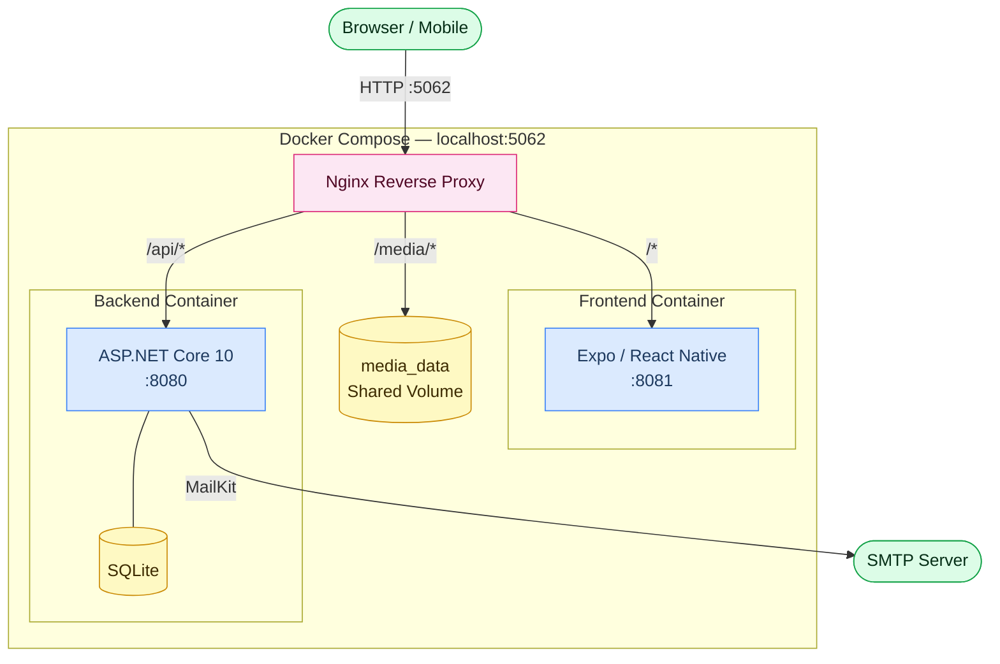

# OpenResto

[](https://coveralls.io/github/karanshukla/openresto)
[](https://coveralls.io/github/karanshukla/openresto)

A self-hosted, zero-dependency restaurant booking system. Customers browse restaurants, hold tables in real-time, and book instantly. Admins manage reservations, tables, floor sections, branding, and booking pauses from a dedicated dashboard — all from a single Docker Compose command with no external services required beyond optional SMTP.


## Tech Stack

| Layer        | Technology                                                        |
| ------------ | ----------------------------------------------------------------- |
| Backend      | ASP.NET Core 10, C#, Entity Framework Core, SQLite                |
| Frontend     | React Native (Expo Router) — web + mobile from one codebase       |
| Auth         | JWT Bearer Tokens (HS256), encrypted HttpOnly cookies             |
| Image gen    | Magick.NET-Q8-AnyCPU (cross-platform, no native deps)             |
| Email        | MailKit (SMTP)                                                    |
| Infra        | Docker Compose, Nginx reverse proxy                               |
| Security CI  | OWASP ZAP API scan on every push (OpenAPI-driven, rules in `.zap-rules.tsv`) |
| Code mappers | Mapperly (source-gen, zero reflection)                            |

## Architecture



## Quick Start

### Docker (recommended)

For local development:

```bash
docker-compose up
```

- App: http://localhost:5062
- API: http://localhost:8080
- Frontend dev: http://localhost:8081

### Local Development

**Prerequisites:** .NET 10 SDK, Node.js 20+

```bash
# Backend
cd OpenRestoApi
dotnet watch run
# → http://localhost:5062

# Frontend (separate terminal)
cd openresto-frontend
npm install
npm run web
# → http://localhost:8081
```

The SQLite database is created automatically on first run.

## Project Structure

```
openresto/
├── OpenRestoApi/                # ASP.NET Core API
│   ├── Controllers/             # API endpoints
│   ├── Core/
│   │   ├── Domain/              # Entities (Booking, Restaurant, Table, etc.)
│   │   └── Application/         # DTOs, interfaces, services, mappings
│   └── Infrastructure/          # EF Core, email, auth, holds, cookies
├── OpenRestoApi.Tests/          # xUnit + Moq tests
├── openresto-frontend/          # Expo/React Native app
│   ├── app/                     # File-based routing
│   │   ├── (user)/              # Customer routes (book, lookup, search)
│   │   └── (admin)/             # Admin routes (dashboard, bookings, settings)
│   ├── api/                     # API client layer
│   ├── components/              # React components
│   ├── context/                 # State management (Theme, Brand)
│   └── hooks/                   # Custom hooks
├── docker-compose.yml           # Multi-container orchestration
└── nginx.conf                   # Reverse proxy config
```

## Configuration

### Backend

Set via environment variables or `appsettings.json`:

| Variable            | Description                     | Default                      |
| ------------------- | ------------------------------- | ---------------------------- |
| `JWT_KEY`           | JWT signing key (min 32 chars)  | Dev key in appsettings       |
| `CONNECTION_STRING` | SQLite connection string        | `Data Source=./openresto.db` |
| `CORS_ORIGINS`      | Comma-separated allowed origins | localhost ports              |
| `Admin:Email`       | Default admin email             | Set in appsettings           |
| `Admin:Password`    | Default admin password          | Set in appsettings           |

### Frontend

| Variable              | Description          | Default                 |
| --------------------- | -------------------- | ----------------------- |
| `EXPO_PUBLIC_API_URL` | Backend API base URL | `http://localhost:5062` |

## Testing

```bash
# Backend tests
dotnet test

# Frontend tests (100% coverage target)
cd openresto-frontend && npm test

# Full frontend coverage report
cd openresto-frontend && npm test -- --coverage
```

## Key Features

### Booking flow
- **Real-time table holds** — when a customer selects a time slot, a 5-minute hold is placed on the specific table via a thread-safe in-memory `ConcurrentDictionary`. The `holdId` must be echoed back at booking time, preventing any other customer from snatching the same table during checkout. Holds auto-expire and are released atomically if the customer changes their selection.
- **Popular-times categorisation** — every 30-minute slot is tagged `Lunch`, `Dinner`, or `Off-Peak` using restaurant industry data (Toast/Square/Yelp benchmarks). The frontend groups available slots into labelled pill tabs so customers can quickly jump to the time period they want.
- **Paused bookings** — admins can halt new reservations until a specific date/time (e.g. during a private event) without touching any configuration files. The availability API checks `BookingsPausedUntil` before returning slots.
- **IANA timezone awareness** — all `DateTime` values are stored in UTC. Restaurant-local open/close hours and slot generation are computed using the restaurant's IANA timezone (`America/New_York`, `Europe/London`, …), so the availability calendar is always correct regardless of where the server runs.

### Admin & management
- **Multi-restaurant support** — manage multiple locations from one instance; each has its own tables, sections, hours, timezone, and branding.
- **Floor sections** — tables are grouped into named sections (e.g. "Patio", "Bar", "Main") so admins can organize seating and customers see which section they're booking.
- **Admin dashboard** — live bookings list with status filtering (active / past / cancelled), extend or cancel reservations, and a customer-name field for front-of-house use.
- **Booking pause** — temporarily suspend new reservations for a restaurant without taking it offline or editing config.

### Branding & UI
- **Full white-label branding** — app name, primary color, and a Lucide icon (utensils, wine, coffee, pizza, flame, leaf, star, heart, chef-hat, fish) are stored in the database. The frontend fetches brand settings on boot and applies them globally via `BrandContext`.
- **Dynamic PWA icons** — `GET /api/brand/pwa-icon.svg` returns an SVG with the brand-colored background and white icon on the fly. `GET /api/brand/pwa-icon-{192|512}.png` rasterizes it with Magick.NET (cross-platform, no ImageMagick apt package needed) for PWA manifest compliance.
- **Skeleton loaders & splash screens** — branded loading states throughout the app; no blank white flashes.

### Security & privacy
- **OWASP ZAP API scan in CI** — every push runs a ZAP API scan against the full Docker stack, using the OpenAPI spec (`/openapi/v1.json`) to discover all endpoints automatically. Ignored rules are tracked in `.zap-rules.tsv`.
- **Rate limiting** — ASP.NET Core built-in rate limiting on sensitive endpoints.
- **Encrypted recent-bookings cookie** — HttpOnly cookie using ASP.NET Core Data Protection so customers can look up their recent reservations without an account.
- **Hard-delete** — admins can permanently erase booking records for GDPR compliance. A GDPR notice is shown on the booking form.
- **No accounts needed** — customers identify via a short `BookingRef` code; no email verification loop.

### Developer experience
- **Single command dev** — `npm run dev` starts the .NET backend (hot reload) and Expo frontend concurrently.
- **100% frontend coverage target** — Jest + React Native Testing Library; Playwright E2E tests against the live Docker stack.
- **Mapperly source-gen mappers** — zero runtime reflection, compile-time DTO mappings.
- **Self-hosted** — runs on any VPS with Docker, SQLite included, no managed database or CDN required.

## License

MIT, do what you want with it
